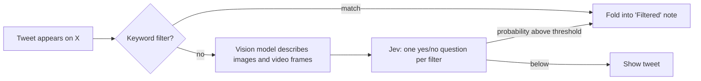

<p align="center">
  
</p>

<h1 align="center">Scarecrow</h1>

<p align="center">Scare away the tweets you don't want. Describe them in plain words, and Scarecrow hides them before you read them, images and videos included.</p>

---

Scarecrow is a Chrome extension for X (Twitter). You write filters the way you'd say them to a friend:

> Don't show me tweets… **with sexual or explicit content**
> Don't show me tweets… **about Taylor Swift, including nicknames and fan accounts**
> Don't show me tweets… **spoiling Severance**

As you scroll, each tweet is checked before you see it. A match folds into a one-line note, such as "Filtered: spoiling Severance, 91% match". Click the note and the tweet opens. A small counter tracks how many tweets Scarecrow kept out today.

## Install

You need Chrome. Other Chromium browsers are untested. Node is not required.

1. Download the latest zip from the [Releases page](../../releases) and unzip it, or clone this repo.
2. Open `chrome://extensions` and turn on **Developer mode**.
3. Click **Load unpacked** and pick the unzipped folder (or the repo folder).
4. Click the Scarecrow icon, then **Edit filters**, and add a filter.
5. For described filters and image checks, add an API key (see below).
6. Refresh any open X tabs.

## Set up a key

Keyword filters run in your browser and need no key. Described filters and image checks send requests to a provider, so they need one:

1. Create a key at [OpenRouter](https://openrouter.ai/settings/keys) or NanoGPT.
2. Open Scarecrow's settings, find **Connect**, pick the service and paste the key.

You pay the provider directly, only for what you use. Scarecrow itself is free.

## Writing filters

There are two kinds.

**Described.** Write what you don't want in plain words. These are judged by Jev, a decision model that returns a probability for each filter instead of generated text. This is the right choice for topics, tone, spoilers, nicknames and anything that keywords would miss.

**Keywords.** List words or phrases to match. These run on your machine, instantly, with no key and no cost.

The settings page has a few examples to start from. Click a filter's text to edit it, or flip its toggle to turn it off.

### Strictness

One dial controls how sure Jev must be before a tweet is hidden:

| Setting | Behavior |
| --- | --- |
| Only clear matches | Hides less. Almost never hides something by mistake. |
| Balanced | The default. Right for most filters. |
| Catch more | Hides borderline tweets too. Expect a few false alarms. |

There is also a slider if you want an exact threshold.

### Ads

Turn on **Hide ads** in settings to fold promoted tweets, the ones X marks "Ad", into a note like any other. It needs no key and no model, and it is off by default. It reads X's English "Ad" label, so it will not catch ads in other languages yet.

### Images and videos

With **Check images and videos** on, a vision model describes each photo, GIF or video thumbnail, and Jev judges that description together with the tweet text. With **Keep checking videos while they play** on, Scarecrow looks at a few frames as the video plays. If one matches, the video pauses and the tweet is filtered.

The vision model is told not to identify people from their faces. A filter about a person matches an image only when their name is visible or mentioned.

## How it works



| File | What it does |
| --- | --- |
| `content.js` | Watches the timeline, extracts each tweet, applies verdicts before X lays the tweet out, runs the hide animation and the counter. |
| `background.js` | Calls the vision model and Jev, caches results for the session, limits concurrent requests. |
| `options.*`, `popup.*` | The settings page and the toolbar popup. |
| `config.js` | Development config. The build replaces it. |
| `scripts/build.mjs` | Production build with test-mode checks. |

A few details that matter on X:

- Undecided tweets are blurred by CSS from the first frame, so nothing flashes unfiltered.
- X reuses tweet elements as you scroll. Scarecrow re-checks a tweet the moment its content changes, before X measures it, so tweets never overlap.
- Collapsing happens in one step rather than animating height, because X positions every tweet itself and per-frame height changes make it jitter.
- If an API call fails, the tweet is shown and the error appears in the popup.

## Privacy

- Your API key is stored only in your browser (`chrome.storage.local`).
- Tweet text goes to the provider you choose (OpenRouter or NanoGPT) under your key. With image checks on, images and sampled video frames go there too.
- Nothing is sent anywhere else. There is no Scarecrow server, no account and no analytics.

## Limitations

- Jev and its Decisions API are in beta, so it will sometimes be wrong. Every hidden tweet leaves a note you can open.
- Videos are judged on a few frames, not the audio. Some protected streams can't be sampled and fall back to the thumbnail.
- X changes its markup now and then. Tweet extraction lives in `extract()` in `content.js`, which is where to look when it breaks.
- Hide ads relies on X's English "Ad" label, and I have not been able to confirm it against every ad format on real X.
- Only Chrome has been tested.

## Development

Test mode lets you try everything without a key or any spend. In `config.js`, set `mockDecisions: true` and reload the extension:

- No API calls. About half of tweets are hidden at random (`mockHideRate`), with made-up match scores and a short fake delay.
- The same tweet always gets the same result, so scrolling back is stable.
- An orange **TEST** badge on the toolbar icon and banners in the popup and settings make it obvious.

Test mode cannot reach production. The build script replaces `config.js` with a locked-off version and checks it, and test mode also refuses to run in any Chrome Web Store install.

To build a release:

```bash
node scripts/build.mjs   # Node 16.7+, no dependencies
```

This writes a clean copy to `dist/`. Zip the contents of `dist/` to upload to the Chrome Web Store or attach to a release.

The landing page is a single file in `site/`. Open `site/index.html` in a browser, or host the folder anywhere that serves static files.

## Contributing

Issues and pull requests are welcome. If X changed its markup and tweets stopped being detected, a fix to `extract()` in `content.js` with a note on what changed is the most useful kind of PR.

## License

[MIT](LICENSE)
